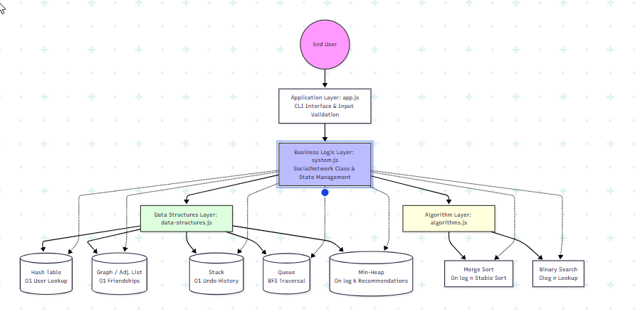

# SocialGraph: Advanced DSA Social Network (Theme A1)

**Course:** Data Structures & Algorithms (Chapter 23: System Design)  
**Project Variant:** A1 – Friends Graph + Mutual-Friends Recommendation  


\


---

## Project Description

SocialGraph is a web/CLI application designed to model a simplified social network. It allows users to register, create bidirectional friendships, undo recent actions, search friends efficiently, and receive intelligent friend recommendations based on mutual connections. The system demonstrates the practical application of advanced data structures and algorithms to optimize user management, friendship networks, and friend recommendations.

---

## Objectives

- Enable fast user registration and lookup using Hash Tables.
- Model friendships as a bidirectional Graph with O(1) edge creation.
- Provide instant undo functionality using a Stack (LIFO).
- Sort friend lists alphabetically using Merge Sort (O(n log n)).
- Search friends efficiently using Binary Search (O(log n)).
- Recommend top-K friends using BFS traversal and a Min-Heap.
- Demonstrate all data structures and algorithms through an interactive CLI and physics-based web visualizer.

---

## Features & Use Cases (DSA Mapping)

- **Add User** – Hash Table (O(1) avg)  
  Fast user registration with unique ID validation and automatic adjacency list initialization.

- **Create Friendship** – Graph / Adjacency List (O(1))  
  Instantly connects two users bidirectionally and logs the action for undo.

- **Undo Last Action** – Stack / LIFO (O(n))*  
  Reverses the most recent friendship action by popping the last operation.

- **Sort Friends** – Merge Sort (O(n log n))  
  Alphabetically ranks a user's friend list for easy browsing and search preparation.

- **Search Friend** – Binary Search (O(log n))  
  Quickly checks if a user exists in a sorted friend list with minimal comparisons.

- **Find Mutual Friends** – BFS + Queue (O(V + E))  
  Counts shared connections by traversing the graph level by level.

- **Top-K Recommendations** – Min-Heap (O(n log k))  
  Suggests the top K friends based on highest mutual connections while maintaining memory efficiency.

*\*Note: Undo is O(n) in the baseline CLI due to array filtering; optimized to O(1) in the frontend visualizer via alternative logic.*

---

## System Workflow

1. User registers with a unique username (e.g., @alice) and full name.
2. The system validates the username and checks for duplicates using the Hash Table.
3. A new user entry is created, and an empty friend list (adjacency list) is initialized in the Graph.
4. User adds a friend by selecting two existing users from the dropdown.
5. The system creates a bidirectional friendship in the Graph and logs the action to the Undo Stack.
6. User requests friend recommendations for a selected user.
7. The system uses BFS + Queue to calculate mutual friends for all non-friend candidates.
8. The Min-Heap extracts the top-K recommendations based on mutual counts (descending order).
9. User searches for a friend – the system sorts the friend list using Merge Sort and applies Binary Search to find the target.
10. User undoes the last action – the system pops the Stack and removes the most recent friendship.

---

## Expected Outcomes

- Fully functional social network with user registration and bidirectional friendship management.
- O(1) average-time user lookups via Hash Table with linear probing.
- Instant undo capability using Stack (LIFO).
- Efficient friend recommendations using BFS and Min-Heap.
- Fast friend search using Merge Sort + Binary Search.
- Interactive CLI for testing and a physics-based web visualizer for demonstration.
- Comprehensive test suite with 30+ test cases covering edge cases and system-wide consistency.

---

## System Architecture

The system follows a clean, layered architecture to separate concerns:

- **Application Layer:** CLI (`app.js`) & Web UI (`index.html`)
- **Business Logic Layer:** `system.js` (SocialNetwork class orchestrating all operations)
- **Data Structures Layer:** `data-structures.js` (Custom HashTable, Stack, Queue, MinHeap)
- **Algorithm Layer:** `algorithms.js` (Merge Sort, Binary Search)

### Architecture Diagram




---

## Technology Stack

- **Language:** JavaScript (Node.js v18+)
- **Runtime:** Node.js for backend / CLI
- **Frontend:** Vanilla HTML5 + CSS3 + Canvas API (No external libraries)
- **Testing:** Native Node.js `assert` module
- **Storage:** 100% In-Memory (No external database required)

---

## Installation & Usage

### Prerequisites
- Node.js (v12 or higher)
- npm (comes with Node.js)

### Setup & Execution

```bash
# 1. Clone the repository
git clone https://github.com/Uthman-dev/DSA-CH23-GROUP
cd [Repository-Folder]

# 2. Start the Interactive CLI
npm start
# OR
node app.js

# 3. Run the Web Visualizer
# Simply open `frontend/index.html` in your browser.
```

---

## Sample Input / Output (CLI Walkthrough)

```bash
$ node app.js

+------------------------------------------+
|              SocialGraph CLI              |
+------------------------------------------+

> Enter your choice (1-7): 1
  -> Enter User ID (must start with @): @alice
  -> Enter User Name: Alice Wonderland
  OK Added user Alice Wonderland (@alice)

> Enter your choice (1-7): 1
  -> Enter User ID (must start with @): @bob
  -> Enter User Name: Bob Builder
  OK Added user Bob Builder (@bob)

> Enter your choice (1-7): 2
  -> Enter User 1 ID: @alice
  -> Enter User 2 ID: @bob
  OK Connected @alice <-> @bob

> Enter your choice (1-7): 4
  -> Enter User ID for recommendations: @alice
  -> Number of recommendations (default 3): 3
  Top 0 recommendation(s) for @alice: (none yet)

> Enter your choice (1-7): 6   # Shows full internal state
  LIVE GRAPH...
  STATS...
  HASH TABLE...
  UNDO STACK...
```

---

## Testing & Quality Assurance

We maintain a comprehensive test suite covering basic operations, edge cases (self-friendships, duplicates), and system-wide consistency.

### Run the Tests
```bash
npm test
# OR
node test.js
```

**Test Coverage:**
- 30+ individual test cases (exceeds the minimum requirement of 15).
- Edge Cases: Duplicate friendships, invalid IDs, empty friend lists, and large-scale sorting.
- Integration Tests: Multi-step scenarios ensuring system state remains consistent after operations.

---

## Web Visualizer (Frontend)

The repository includes a standalone HTML file (`index.html`) that renders the social graph using a force-directed physics engine (Canvas API). The interface features a product-focused design with tabs for:

- **Hash Table** – Visualizes the internal array with linear probing.
- **History** – Shows the LIFO undo stack of past actions.
- **Recommendations** – Displays the top-K friend suggestions generated by the Min-Heap.

Simply open `index.html` in any modern browser. No server is required – all data structures and algorithms are embedded directly in the script tag.

---

## Team Members & Roles (5-Person Team)

- **Team Lead / Integrator + System Design Lead – BIT/2024/74642 UTHMAN MWONGERA**  
  Coordinates project activities, manages GitHub repository, oversees integration of all system components, owns the Chapter 23 5-step methodology, and leads the System Design Report.

- **Data Structures Lead + Algorithms Lead – BIT/2024/56261 JAMES MAM**  
  Implements HashTable, Stack, Queue, MinHeap, mergeSort, binarySearch, and BFS logic. Conducts complexity analysis and scalability benchmarking.

- **Backend / API Developer + CLI Developer – BIT/2024/74851 SEAN KITETU**  
  Develops system.js (business logic), server.js (REST API), and app.js (interactive CLI). Connects backend logic to the frontend.

- **UI / Frontend Developer – BIT/2024/73485 IAN KIRUI**  
  Designs and builds the web visualizer (`index.html`) with graph rendering and physics engine. Ensures a user-friendly experience.

- **Testing & QA Lead + Performance/Benchmark + Documentation + Demo Presenter – BIT/2022/51502 VICTOR KIVINDA**  
  Writes test cases (test.js), runs benchmarks, maintains project documentation (README, System Design Report), records and edits the project demonstration video.

---
## Hosted site

This site was hosted on netlify for the frontend visualization

[Click here to see the hosted site ](https://dsa-ch23-group.netlify.app/)

---

## Demo Video

Watch our full 5–8 minute walkthrough covering the running system, DSA implementation, scalability bottlenecks, and Q&A.

[Click here to watch the demo on YouTube](https://youtu.be/znM77tDQmj4)

---

## Acknowledgement of AI Use

Artificial Intelligence (AI) was used as a learning and research aid during the development of this project. AI assisted in understanding data structures, algorithms, system design concepts, and complexity analysis. All project decisions, implementation, review, testing, and final presentation were completed by the project team.

---

## References

- Hemant Jain – Chapter 23: System Design
- Cormen, Leiserson, Rivest, Stein – Introduction to Algorithms (CLRS)
- Martin Kleppmann – Designing Data-Intensive Applications
```


